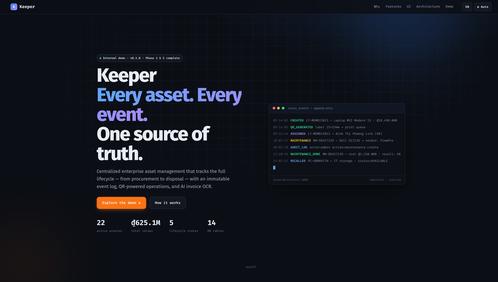
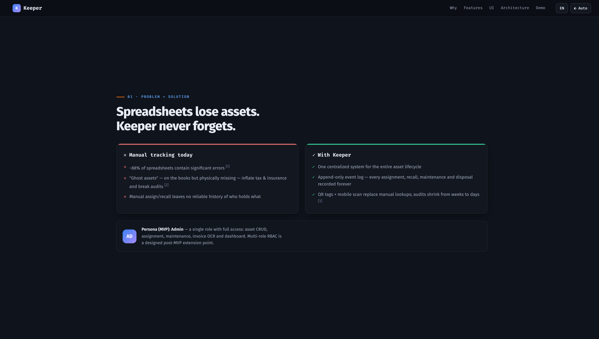
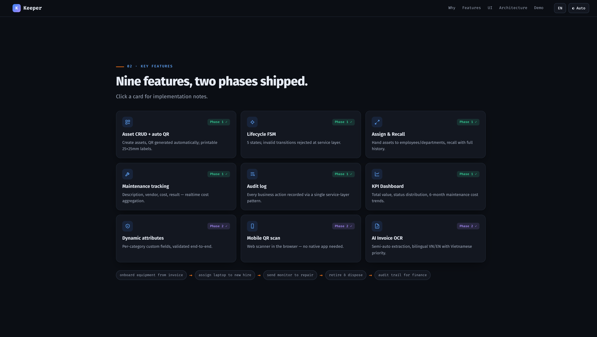
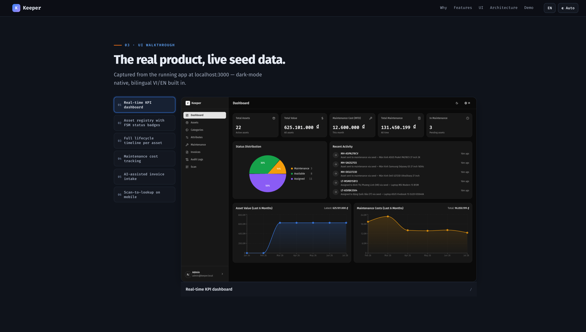
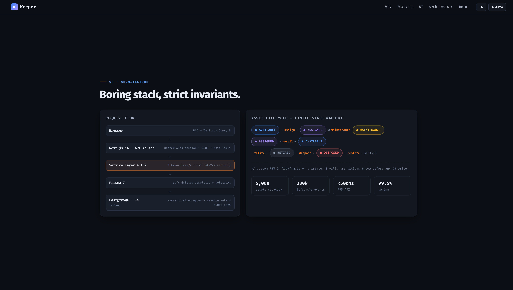
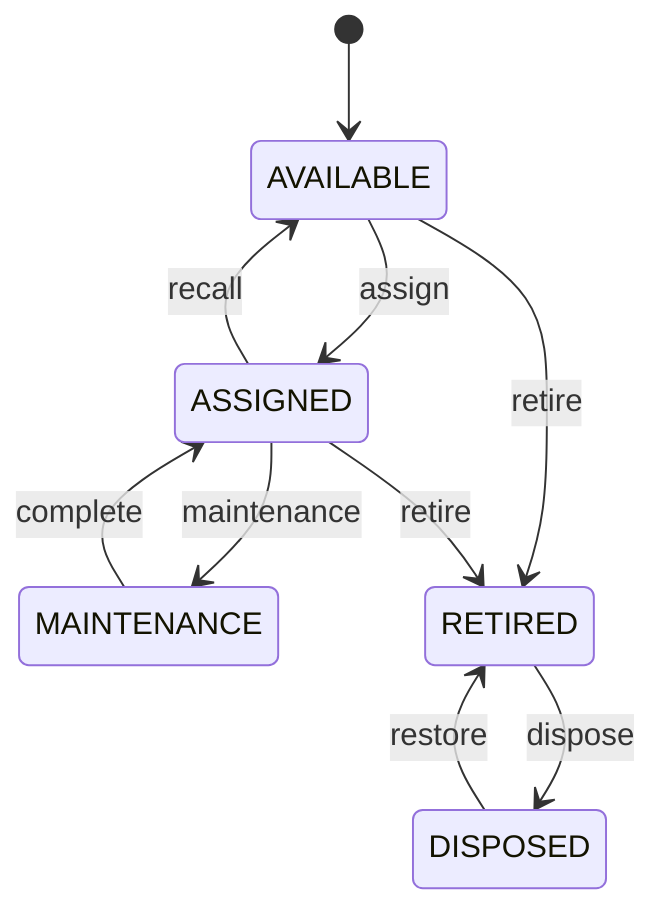

# Keeper — Asset Management

Centralized enterprise asset management: full lifecycle tracking (procurement → disposal), immutable event log, QR-powered operations, and AI invoice OCR. See the canonical PRD at [`docs/prd-v1.md`](docs/prd-v1.md).

## ✨ Showcase

[](assets/showoff/asset-management-demo/index.html)

|                                                                                                                                               |                                                                                                                                                   |
| --------------------------------------------------------------------------------------------------------------------------------------------- | ------------------------------------------------------------------------------------------------------------------------------------------------- |
| [](assets/showoff/asset-management-demo/index.html) | [](assets/showoff/asset-management-demo/index.html)           |
| [](assets/showoff/asset-management-demo/index.html)  | [](assets/showoff/asset-management-demo/index.html) |

<p align="center">
  
</p>

Asset lifecycle FSM (`lib/fsm.ts` — invalid transitions throw before any DB write):



<details>
<summary><b>Nine features, two phases shipped</b> (click to expand)</summary>

| Feature              | Phase | Notes                                                       |
| -------------------- | ----- | ----------------------------------------------------------- |
| Asset CRUD + auto QR | 1 ✓   | `qrcode` 1.5.4 · printable 25×25mm labels                   |
| Lifecycle FSM        | 1 ✓   | 5 states · `validateTransition()` at service layer          |
| Assign & Recall      | 1 ✓   | full history via `asset_events`                             |
| Maintenance tracking | 1 ✓   | vendor, cost, result · realtime aggregation                 |
| Audit log            | 1 ✓   | `logAssetEvent()` on every business action                  |
| KPI Dashboard        | 1 ✓   | Recharts · total value, status distribution, 6-month trends |
| Dynamic attributes   | 2 ✓   | PostgreSQL JSONB + Zod per category                         |
| Mobile QR scan       | 2 ✓   | `html5-qrcode` in browser — no native app                   |
| AI Invoice OCR       | 2 ✓   | GPT-4o-mini · bilingual VN/EN, Vietnamese priority          |

</details>

---

This is a [Next.js](https://nextjs.org) project bootstrapped with [`create-next-app`](https://nextjs.org/docs/app/api-reference/cli/create-next-app).

## Getting Started

First, run the development server:

```bash
npm run dev
# or
yarn dev
# or
pnpm dev
# or
bun dev
```

Open [http://localhost:3000](http://localhost:3000) with your browser to see the result.

You can start editing the page by modifying `app/page.tsx`. The page auto-updates as you edit the file.

This project uses [`next/font`](https://nextjs.org/docs/app/building-your-application/optimizing/fonts) to automatically optimize and load [Geist](https://vercel.com/font), a new font family for Vercel.

## Learn More

To learn more about Next.js, take a look at the following resources:

- [Next.js Documentation](https://nextjs.org/docs) - learn about Next.js features and API.
- [Learn Next.js](https://nextjs.org/learn) - an interactive Next.js tutorial.

You can check out [the Next.js GitHub repository](https://github.com/vercel/next.js) - your feedback and contributions are welcome!

## Deploy on Vercel

The easiest way to deploy your Next.js app is to use the [Vercel Platform](https://vercel.com/new?utm_medium=default-template&filter=next.js&utm_source=create-next-app&utm_campaign=create-next-app-readme) from the creators of Next.js.

Check out our [Next.js deployment documentation](https://nextjs.org/docs/app/building-your-application/deploying) for more details.
